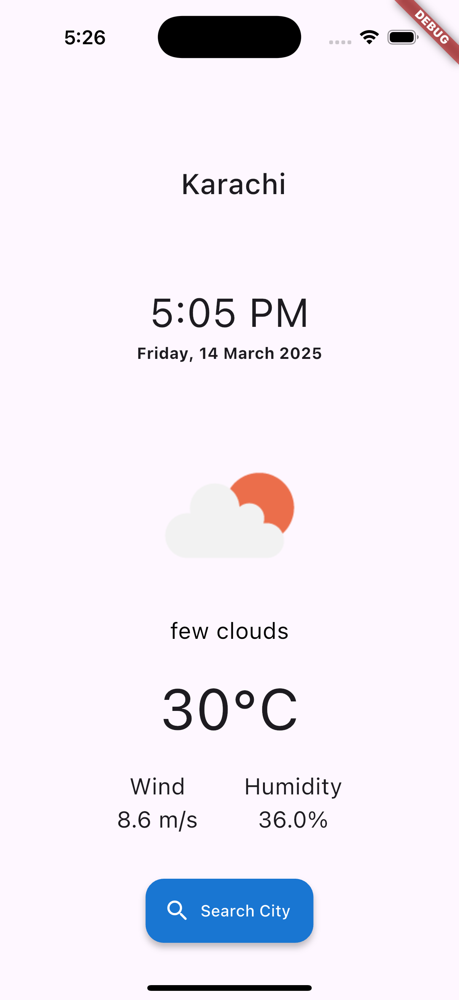

# Weather App

A clean Flutter weather application that provides current weather information using the OpenWeatherMap API.

## Features

- Real-time weather data display
- City-based weather search functionality
- Current temperature in Celsius
- Wind speed and humidity information
- Dynamic weather icons based on conditions
- Clean, minimalist UI

## Screenshots

## Implementation Details

- Built with Flutter and Dart
- Uses the `weather` package to interact with OpenWeatherMap API
- Displays city name, current date and time, weather description, temperature, wind speed, and humidity
- Includes a search dialog for finding weather in different cities

## Getting Started

### Prerequisites
- Flutter SDK
- Dart SDK
- OpenWeatherMap API key

### Installation
1. Clone this repository
2. Set up your API key in the constants file
3. Run `flutter pub get` to install dependencies
4. Launch with `flutter run`

## Next Steps
- Add forecast functionality
- Implement location-based weather
- Add temperature unit conversion
- Create weather alerts and notifications

## License
This project is licensed under the MIT License